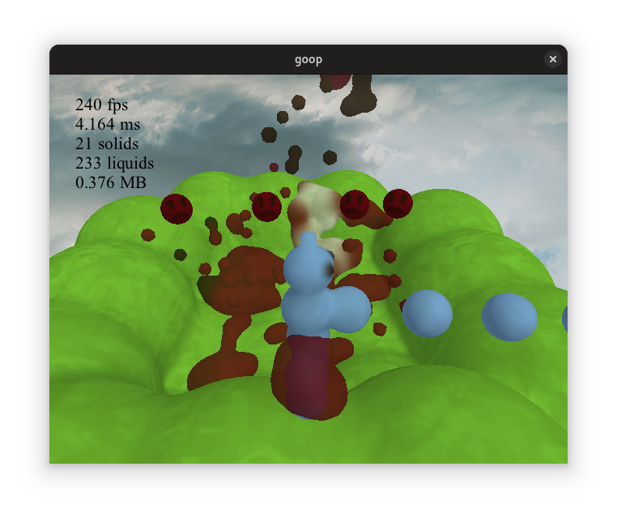

# goop

This is a little liquid simulation project I made. It features realtime liquids in a game environment that are rendered via raymarching. This is quite performance intensive, so a decent dedicated GPU is required.

Some information about the project:
* Uses C and OpenGL
* Everything, including the ground, is made up of blobs
* Liquid/solid blobs are stored in an octree which speeds up collision and rendering

## Showcase

https://github.com/user-attachments/assets/df1fe7ad-6eb5-403b-9908-ae0c63e857d0

## Building

Requirements:
* Windows
* Visual Studio 2022
* Python (must be "py" in PATH)
* [glslang](https://github.com/KhronosGroup/glslang) and [spirv-cross](https://github.com/KhronosGroup/SPIRV-Cross) (both must be in PATH)

Open the .sln file with Visual Studio and build the project.
